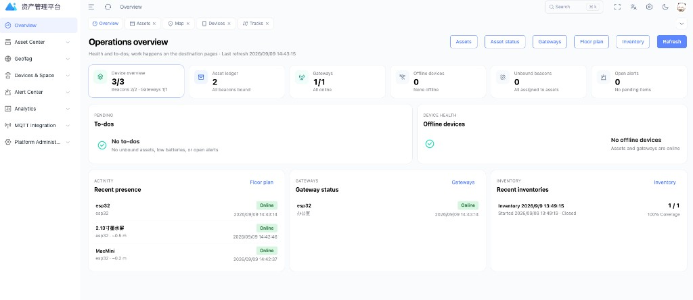
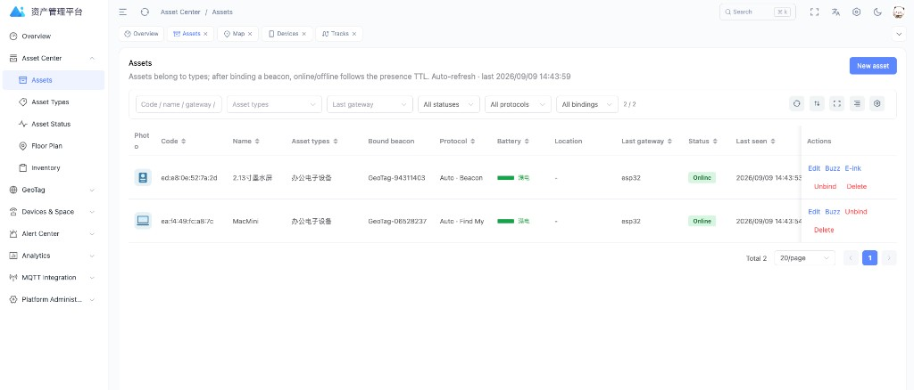
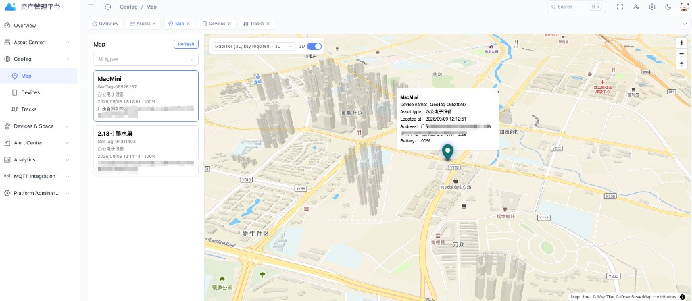

# 资产管理平台

**版本 1.0.7**

管现场资产、蓝牙信标、网关和平面图，也能对接 GeoTag 看室外定位和轨迹。网关把扫描报到本机 MQTT，网页上看在线、告警、盘点，也能找东西、改墨水屏、给资产配图。

现场 App 和网页走同一套 `/api/v1`，不用另开服务。手机和浏览器都不直接连 MQTT，只有网关连。

[English](#asset-management) 在下面。

## 界面预览







---

## 开源协议

本项目按 **[AGPL-3.0-or-later](LICENSE)** 开源（GNU Affero General Public License v3 或更新版本）。

版权 © 2026 GeoTag。完整条文在仓库根目录的 [`LICENSE`](LICENSE)。

没有授权码也能管资产、看在线、收扫描、告警、盘点和 GeoTag 地图。官方安装包里，下面这些需要我们签发的授权码：

- 告警通知（邮箱 / Webhook）
- 改登录页底部版权

---

## 怎么装

给客户：用 Ubuntu 22.04 或 24.04（64 位）的新机器，解压离线包，执行：

```bash
sudo ./install_zh.sh
```

英文界面用 `install_en.sh`。安装时会问管理员账号密码，不填就停，不会给默认密码。

离线包比较大，放在 [Releases](https://github.com/komyo-wong/AssetManagement/releases)，不放在源码里。包里的说明看 `README_zh.txt`。

已经装过、只想升级、数据要留着：把新包解压到新目录，跑 `sudo ./upgrade_zh.sh`。

装好以后说明书在 `http://这台机器/guide/`，不用登录。

---

## 自己跑一份看看

本机要有 Docker、JDK 25、Maven、Node 20、pnpm。

```bash
cp infra/.env.example infra/.env          # 把里面的 CHANGE_ME 改掉
cd infra && docker compose up -d

cd ../server
mvn -DskipTests package -pl platform-api,mqtt-worker -am

cd ..
./run-api-local.sh          # :8080
./run-worker-local.sh       # :8081，另开一个终端
./run-web-local.sh          # :3006
```

本机开发要自己设管理员密码：`export DEV_ROOT_PASSWORD=...`（或写进已忽略的 `server/.env.local`）。未配置则**不会**创建默认管理员，别把口令写进仓库。

更细的菜单说明：[中文说明书](docs/user-guide/zh/README.md) · [English guide](docs/user-guide/en/README.md)

---

## 目录大概长什么样

| | |
| --- | --- |
| `web/` | 管理网页（含 GeoTag 地图 / 轨迹） |
| `server/platform-api/` | HTTP 接口、GeoTag 对接 |
| `server/mqtt-worker/` | 收 MQTT、往下发 |
| `server/platform-core/` | 共用业务代码 |
| `infra/` | 本机 Postgres / Redis / MQTT |
| `deploy/offline/` | 打客户安装包的脚本 |
| `docs/user-guide/` | 说明书原稿（中/英） |

---

# Asset Management

**Version 1.0.7**

A shop-floor asset system: beacons, gateways, indoor maps, GeoTag outdoor GPS, presence, alerts, inventory, find-my-asset, e-ink screens, and asset photos. Gateways talk MQTT. The web UI and the field app share `/api/v1`. Phones and browsers do not connect to the broker.

## Screenshots


## License

**[AGPL-3.0-or-later](LICENSE)** — see [`LICENSE`](LICENSE). Copyright © 2026 GeoTag.

Without a token you can run assets, scans, alerts, inventory, and GeoTag maps. Official builds need a signed token for alert email/webhook and for changing the login-page copyright.

## Install

On a new Ubuntu 22.04 / 24.04 x86_64 machine, unpack the release tarball and run `sudo ./install_en.sh`. You must set the admin password yourself.

The image pack lives in [Releases](https://github.com/komyo-wong/AssetManagement/releases), not in git. To upgrade without wiping data: `sudo ./upgrade_en.sh`.

## Run it locally

Docker, JDK 25, Maven, Node 20, pnpm. Copy `infra/.env.example` to `infra/.env`, start compose, `mvn package` the two server modules, set `DEV_ROOT_PASSWORD` (no default admin is created if it is empty), then `./run-api-local.sh`, `./run-worker-local.sh`, `./run-web-local.sh`.

Guide: [docs/user-guide/en/README.md](docs/user-guide/en/README.md)
