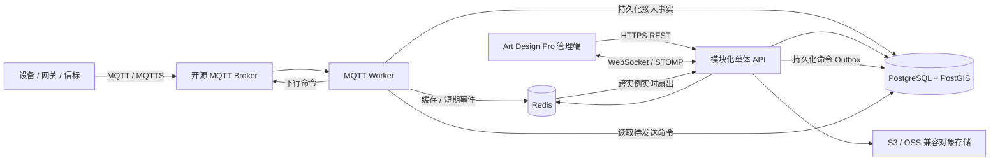
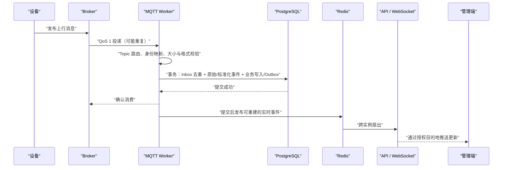

# 系统架构设计

> 架构基线：模块化单体 API + 独立 MQTT Worker  
> 原则：先保证边界、可靠性和可演进性，不为尚未出现的规模预付微服务复杂度。

## 1. 架构目标

- 用一个清晰的业务模型覆盖 SaaS 平台、租户、多项目资产管理和真实设备接入。
- API 与 MQTT 长连接、消息消费解耦，使 Web 请求和设备流量可分别扩容。
- PostgreSQL 保存所有核心事实；Redis 只承担缓存、限流、短期队列和实时分发。
- MQTT Broker 可替换、可多实例配置，不依赖任何商业特性。
- 每次访问均能回答“谁、在哪个平台/租户/项目范围、对哪个资源、执行什么动作”。
- 设备消息在重复、乱序、断连和进程重启情况下仍可追踪、可恢复。

## 2. 总体结构

### 2.1 可部署单元

| 单元 | 目录 | 主要职责 | 扩容方式 |
| --- | --- | --- | --- |
| Web | `web/` | Art Design Pro、业务页面、权限展示、国际化 | 静态资源/CDN |
| API | `server/platform-api/` | REST、认证授权、业务事务、WebSocket、OpenAPI | 无状态水平扩容 |
| MQTT Worker | `server/mqtt-worker/` | Broker 连接、订阅、解析、幂等、上行接入、下行发布 | 按 Broker/连接组分片扩容 |
| 共享核心 | `server/platform-core/` | 领域模型、共享端口和稳定基础能力 | 作为构建模块，不单独部署 |
| 基础设施 | `infra/` | 本地 PostgreSQL/PostGIS、Redis、Mosquitto | 环境分别部署 |

API 与 Worker 可以共享稳定的领域类型和端口，但不能通过内存相互调用；二者的运行时协作必须经 PostgreSQL、Redis 或 MQTT 完成。

## 3. 技术基线

| 层 | 技术 |
| --- | --- |
| 前端 | Art Design Pro v3.0.2、Vue 3、TypeScript、Vite、Element Plus、Pinia、Vue Router |
| 图表与室内地图 | ECharts、Konva/vue-konva |
| 后端 | Java 25、Spring Boot 4.1、Spring Security |
| 数据访问 | Spring Data JPA + Spring JDBC |
| 数据库 | PostgreSQL 18 + PostGIS |
| 缓存与短期事件 | Redis 8 |
| MQTT 客户端 | HiveMQ MQTT Client 开源客户端库 |
| 本地 Broker | Eclipse Mosquitto 2 |
| 实时推送 | Spring WebSocket + STOMP |
| 数据库迁移 | Flyway |
| 接口契约 | OpenAPI 3.1 |
| 文件 | S3/OSS 兼容对象存储 |
| 测试 | JUnit、Testcontainers、Vitest、Playwright |
| 可观测性 | Actuator、Micrometer/Prometheus、结构化日志、OpenTelemetry |

具体补丁版本由构建文件锁定，并在升级前通过兼容性和回归测试。

## 4. 模块化单体边界

### 4.1 API 业务模块

| 模块 | 负责 | 不直接负责 |
| --- | --- | --- |
| Identity | 登录、会话、密码、账户状态 | 项目内角色 |
| Authorization | 角色、权限、策略求值 | 业务数据 CRUD |
| Tenant | 客户组织、租户成员、租户上下文、启停与归档 | 项目业务数据 CRUD |
| Project | 项目、成员关系、项目上下文、归档 | 平台账户认证 |
| Asset | 资产、类型、绑定关系、当前状态 | MQTT 网络连接 |
| Device Registry | 网关、信标、设备类型、解析配置 | 告警生命周期 |
| Map & Zone | 地图元数据、标定、区域几何 | 设备报文解析 |
| Location | 位置计算/接收、当前位置、轨迹 | 地图文件存储实现 |
| Alert | 规则、告警生成、确认、处理、恢复 | 通用通知供应商 |
| Inventory | 盘点任务、范围、进度和结果 | 资产主数据所有权 |
| Collaboration | 任务、评论、项目文档元数据 | 身份认证 |
| MQTT Management | Broker、连接组、Topic 路由、协议版本 | Worker 进程内连接生命周期 |
| Reporting | 聚合查询、看板、异步导出 | 修改领域事实 |
| File | 上传、下载、版本和对象存储端口 | 文档业务权限决策 |
| Audit | 追加式审计事件、查询和导出 | 修改原业务事务 |

### 4.2 模块协作规则

- 模块只通过公开应用服务、领域事件或只读查询端口协作。
- 禁止一个模块直接修改另一个模块拥有的表。
- 跨模块强一致操作尽量保持在一个数据库事务内；异步操作使用 Outbox。
- 报表可读取多个模块的只读投影，但不能借报表路径绕过权限。
- Worker 依赖公开的接入端口和协议模型，不依赖 API Controller。

## 5. 数据与存储

### 5.1 PostgreSQL/PostGIS

PostgreSQL 是以下数据的最终事实来源：

- 用户、会话摘要、平台角色、租户、租户成员、项目、项目成员和权限。
- 资产、网关、信标、类型、绑定历史和当前状态。
- 地图、区域、位置、轨迹、告警和盘点。
- MQTT 配置元数据、协议版本、消息接入记录、命令、ACK 和 Outbox。
- 任务、评论、文档元数据、文件版本和审计日志。

设计约束：

- 所有租户业务表包含不可为空的 `tenant_id`；项目业务表同时包含不可为空的 `tenant_id` 与 `project_id`；平台全局表必须显式标记为平台范围。
- 项目必须且只能属于一个租户，数据库外键同时校验 `(tenant_id, project_id)`，不能只凭全局 UUID 假定租户归属。
- 业务唯一键通常包含 `tenant_id`，项目内编码再包含 `project_id`，避免租户或项目互相占用业务编码。
- 室内坐标点、区域多边形和空间包含查询使用 PostGIS；具体坐标参考系待地图协议确认。
- 高增长的原始消息、轨迹和审计表采用按时间分区，并由保留策略归档或清理。
- 外键、唯一约束和检查约束承担数据完整性的第一层防线。
- 业务删除默认使用归档状态；只有受控的数据保留任务可以物理清理。

### 5.2 Redis

Redis 可用于：

- 热点缓存、权限计算缓存和短时设备在线状态。
- 登录限流、验证码、分布式租约和幂等辅助窗口。
- Redis Streams 的短期工作分发。
- WebSocket 跨 API 实例的实时消息扇出。

Redis 不得成为资产历史、告警、轨迹、盘点、设备命令或审计的唯一存储。关键异步任务必须在 PostgreSQL 中存在可恢复记录；Redis 数据丢失后，可以从数据库重建或重放必要状态。

### 5.3 对象存储

- 保存地图、头像、项目文档、导入源文件和导出结果。
- 数据库只保存对象键、校验和、大小、MIME、版本和权限元数据。
- 下载使用短时授权地址或 API 代理，不能公开永久对象地址。
- 上传完成前后均校验大小、类型和校验和；生产环境预留恶意文件扫描。

## 6. 核心数据流

### 6.1 Web 请求

1. 浏览器携带短期 Access Token 发起请求。
2. API 验证用户、会话、账户状态和令牌版本。
3. 从 `/api/v1/tenants/{tenantId}/projects/{projectId}/...` 路径解析租户与项目，校验项目确实属于租户；不能只信任前端提交的 `tenant_id` 或 `project_id`。
4. 授权器依次校验平台、租户、项目作用域、权限码、数据范围和资源归属。
5. 应用服务执行事务，并在同一事务写入必要的审计摘要或 Outbox。
6. 响应仅返回调用者有权看到的字段；敏感值始终脱敏。

### 6.2 MQTT 上行

处理原则：

- 只有持久化事务提交成功后，才确认需要手动确认的 MQTT 消息。
- QoS 1 仍可能重复，唯一约束和 Inbox 幂等键是最终保障。
- 无法解析或无法绑定设备的消息进入可查询的隔离记录，不无限重试阻塞整个订阅。
- 关键领域状态转换不得只依赖 Redis 消息；同步完成或保留数据库中的待处理记录。
- 原始报文是否长期保留由数据保留策略决定，但接入元数据和错误原因必须可追踪。

### 6.3 MQTT 下行

1. 用户从 API 创建命令；API 验证设备归属、操作权限、参数和协议版本。
2. 同一事务创建命令记录、Outbox 和审计摘要。
3. Worker 领取待发布命令，根据绑定的 Broker、路由和协议版本生成报文。
4. 发布成功只表示 Broker 接受，不代表设备执行成功。
5. 设备 ACK 通过上行链路进入系统，以关联标识更新命令状态。
6. 超时任务把未确认命令标记为超时；是否重试必须遵守设备协议的幂等规则。

没有用户提供的下行与 ACK 协议时，只建设通用能力，不开放虚假的设备控制按钮。

### 6.4 实时页面

- 数据库先提交事实，再发布实时提示。
- WebSocket 目的地按用户、租户和项目授权隔离；客户端不能自行订阅其他租户或项目频道。
- 实时消息只用于提示变化和轻量增量，不作为页面唯一数据来源。
- 断线重连后，前端通过 REST 使用游标或更新时间补取状态。
- 慢客户端采用限频、合并或断开策略，不能反压核心 MQTT 消费。

## 7. MQTT 多 Broker 与 Worker 模型

- Broker 配置按环境、连接组和优先级管理；平台连接向租户/项目显式授权，租户连接只能授权给本租户项目。
- 每个活动连接使用稳定且唯一的 Client ID；Clean Start、Session Expiry、Keep Alive 和 QoS 均由配置确定。
- Worker 多实例运行时，一个逻辑连接由一个持有租约的实例负责；租约必须带过期和防陈旧持有者机制。
- 主备切换只在两个 Broker 被确认承载同一逻辑数据源、Topic 和凭据语义时启用。
- 切换期间按至少一次语义处理，允许重复但不能重复产生业务结果。
- 单个 Broker 故障不能阻止其他 Broker 的连接与消息处理。
- 连接、订阅、重连、切换、积压和解析失败均输出指标及结构化事件。

具体协议模型见 [mqtt-protocol.md](./mqtt-protocol.md)。

## 8. 一致性与可靠性

### 8.1 Inbox / Outbox

- **Inbox**：记录外部消息的幂等键、来源、协议版本、接收时间和处理结果。
- **Outbox**：与业务事务一起提交，随后可靠地投递实时事件或 MQTT 命令。
- 消费方仍需幂等，因为“事务提交后、确认或发布前”崩溃会导致重复。
- Outbox 采用带锁领取、重试次数、下次重试时间和终态；不能无限热循环。
- 定期校验和告警长期未处理、反复失败及死信记录。

### 8.2 顺序与时间

- 同一设备若提供单调序列号，按设备与消息类型检测重复、回退和缺口。
- 未提供序列号时不能声称严格顺序；以设备时间和接收时间共同判断。
- 当前状态更新应拒绝明显早于已处理版本的旧消息覆盖新状态。
- 所有时间持久化为 UTC，同时保存必要的设备原始时间和时钟偏差。

### 8.3 恢复

- API 与 Worker 使用优雅关闭，停止接收新工作后完成或释放已领取任务。
- PostgreSQL 定期备份并验证恢复；恢复目标由生产 SLA 确认。
- Redis 重启后重新建立缓存、租约和实时订阅。
- Broker 断线按有上限的指数退避加随机抖动重连，避免故障恢复时连接风暴。
- 解析规则升级保留版本，历史消息始终关联其实际使用的版本。

## 9. 安全架构

### 9.1 人员身份

- 密码采用自适应哈希；Root 和超级管理员应支持更强认证策略，MFA 纳入上线前安全项。
- Access Token 短期有效并保存在前端内存；刷新凭证使用 `HttpOnly`、`Secure`、合适 `SameSite` 的 Cookie。
- 刷新会话可单独撤销，密码或权限重大变更可提升令牌版本使旧令牌失效。
- 所有授权由后端执行，前端路由和按钮权限只改善体验。

### 9.2 租户与项目隔离

- 应用层每次租户业务查询显式携带已授权 `tenant_id`，项目业务查询同时携带已验证的 `project_id`。
- 数据库行级安全作为第二道防线时，使用事务级用户、租户和项目变量，并对连接池复用进行清理测试。
- 普通租户管理员不能通过猜测 UUID、批量接口、导出、对象键、缓存键或 WebSocket 频道跨租户访问。
- 平台后台任务和受控管理操作使用独立数据库角色，不让普通请求共享绕过权限。
- 文件对象键、WebSocket 频道、导出任务和缓存键同样包含作用范围。

### 9.3 设备与 Broker

- Worker 使用最小 Topic ACL 的专用 Broker 账户；设备账户不能订阅管理 Topic。
- Broker 密码、私钥和证书密文入库，主密钥来自部署环境或密钥管理服务，不与密文存放在同一数据库。
- API 永不返回可还原的密钥；更新凭据采用“仅写”字段。
- Topic、连接授权与载荷中的设备身份必须交叉校验，不能让载荷任意声明另一个租户或项目。
- 设置载荷大小、频率、嵌套深度和解析时间限制。

### 9.4 审计

- 登录、成员、权限、项目、Broker、协议、告警规则、盘点和设备命令必须审计。
- 审计记录追加写入，普通管理员不能修改或删除。
- 审计只记录必要变更摘要；密码、Token、私钥和完整敏感载荷必须脱敏。

权限细节见 [rbac.md](./rbac.md)。

## 10. 可观测性

### 10.1 指标

- API：请求量、延迟、错误率、数据库连接池、WebSocket 连接数。
- Worker：各 Broker 连接状态、消息速率、确认延迟、重连、解析失败和隔离量。
- 业务：设备在线变化、告警产生/恢复、定位处理延迟、盘点积压。
- 异步：Inbox/Outbox 待处理、重试、最老任务年龄和死信量。
- 依赖：PostgreSQL、Redis、对象存储和 Broker 可用性。

### 10.2 日志与追踪

- HTTP 使用请求 ID；MQTT 使用消息关联 ID；下行命令使用命令 ID。
- 日志采用结构化字段，包含模块、范围、目标和结果。
- Trace 在 API、数据库操作、Outbox 和 Worker 之间传播可用的关联标识。
- 原始设备载荷默认不进入普通应用日志。

## 11. 部署建议

### 11.1 本地开发

`infra/docker-compose.yml` 提供只绑定本机的 PostgreSQL/PostGIS、Redis 和 Mosquitto。开发者分别启动 API、Worker 和 Web，便于调试。

### 11.2 生产

- Web 静态资源、API、Worker、PostgreSQL、Redis、Broker 和对象存储独立部署。
- 所有外部流量通过 TLS；数据库和 Redis 不暴露公网。
- Mosquitto 可满足小规模或单节点场景；需要高可用时评估开源 Broker 的真实集群能力和运维成本，应用层保持标准 MQTT 兼容。
- 先通过真实流量基准决定 API/Worker 副本、数据库规格和分区策略。
- 未出现明确需要前，不引入 Kubernetes、Kafka 或服务网格。

## 12. 架构守则

以下条件不得以“先做出来”为由破坏：

1. 不把 `tenant_id` 或 `project_id` 完全交给前端决定，也不把项目当成租户替代品。
2. 不把 Redis 当作业务历史的唯一来源。
3. 不在 MQTT 样例缺失时猜测 Topic 或字段。
4. 不把 Broker 发布成功等同于设备执行成功。
5. 不依赖隐藏菜单实现安全。
6. 不在日志、接口或前端配置中暴露凭据。
7. 不使用无版本解析规则覆盖既有消息语义。
8. 不用假数据掩盖接口未实现或处理失败。

## 13. 仍待决策的架构输入

- 设备规模、峰值吞吐、历史保留期和可用性目标。
- 生产 Broker 的开源实现与部署拓扑。
- 真实 Topic、载荷、命令和 ACK 约定。
- 定位输入、算法及坐标参考系。
- 对象存储、邮件或其他通知渠道。
- 是否迁移现有数据及停机切换策略。

这些输入会影响容量和部署，不改变“模块化单体 + 独立 MQTT Worker + PostgreSQL 为事实源”的总体方向。
