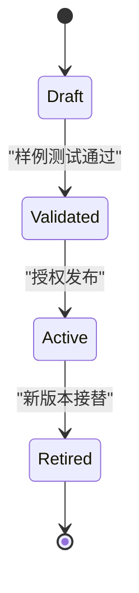
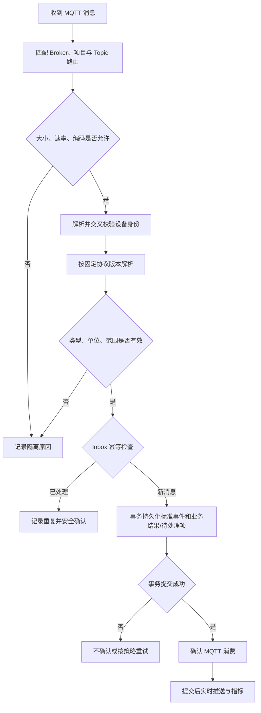
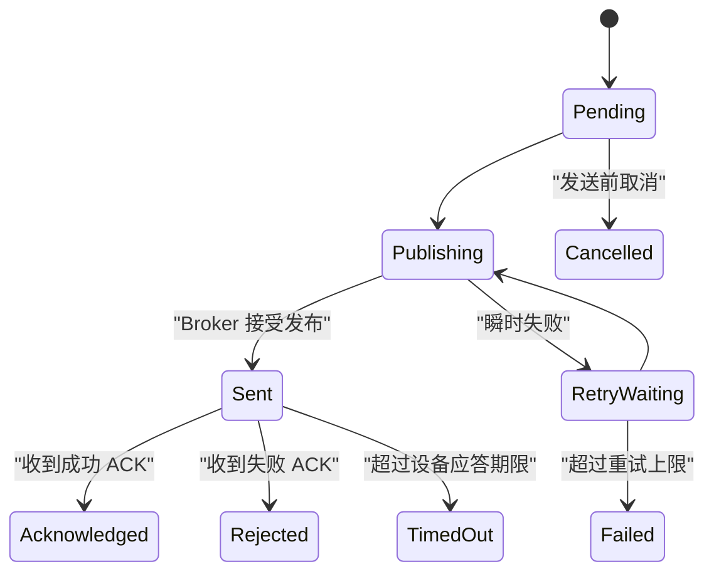

# MQTT 接入与协议约定

> 状态：已确认网关 MQTT 样例（GwData / adv_srp）。  
> 重要：本文不定义任何真实 Topic、字段、单位或设备命令；尖括号内容均为待用户提供的占位描述。

## 1. 目标与边界

平台通过开源 MQTT Broker 接收真实设备信息，并将数据可靠地转换为资产状态、定位输入、告警、盘点结果和实时页面事件。平台同时预留下行命令与设备 ACK 能力，但只有在获得真实协议后才开放具体控制。

设计边界：

- 支持多个 Broker、环境区分、项目授权和主备端点。
- 兼容 MQTT 3.1.1 与 5.0；实际能力取决于目标 Broker 和设备。
- 支持 MQTT、MQTTS、WS、WSS；浏览器管理端不直接连接 Broker。
- 按至少一次语义设计，接受重复投递并通过幂等避免重复业务结果。
- Broker 仅负责传输；项目隔离、设备归属和业务授权由平台再次验证。
- Redis 可加速分发，但核心接入和业务历史必须落 PostgreSQL。

## 2. 术语

| 术语 | 含义 |
| --- | --- |
| Broker 配置 | 一个逻辑 MQTT 数据源及其认证、协议和运行参数 |
| 端点 | Broker 配置下的一个连接地址，可标记主或备 |
| 连接组 | Worker 用于运行一个逻辑订阅会话的配置集合 |
| 项目绑定 | 允许某项目使用某个 Broker/连接组的授权关系 |
| Topic 路由 | Topic 过滤器、方向、消息类型、项目/设备解析和协议版本的组合 |
| 解析规则 | 把设备原始载荷转换为平台标准事件的版本化定义 |
| Inbox | 上行消息的持久化幂等与处理记录 |
| Outbox | 与业务事务一起提交、随后由 Worker 发送的下行命令或事件 |
| ACK | 设备对下行命令的业务应答，不等同于 MQTT 协议层 PUBACK |

## 3. Broker 配置模型

### 3.1 逻辑配置

每个 Broker 配置至少包含：

| 分类 | 字段 |
| --- | --- |
| 基本 | 名称、编码、说明、启用状态、开发/测试/生产环境 |
| 协议 | MQTT 3.1.1 或 5.0、TCP/TLS/WS/WSS |
| 会话 | Client ID 模板、Clean Start/Clean Session、Session Expiry、Keep Alive |
| 可靠性 | 默认 QoS、连接超时、重连退避、最大重试、在途消息上限 |
| 安全 | 用户名、仅写密码、CA、客户端证书、仅写私钥、服务端名称校验 |
| 限制 | 最大载荷、消息速率、订阅数量和解析超时 |
| 运维 | 所属连接组、配置版本、最后连接结果、错误摘要 |

敏感字段的要求：

- 密码和私钥加密存储，API 只返回“已配置”状态。
- 编辑页面不回填明文；留空表示不变，显式操作才清除。
- 主密钥来自部署环境或密钥管理服务，不与密文保存在同一数据库。
- 测试连接由后端执行，结果日志必须脱敏。

### 3.2 端点与主备

一个逻辑配置可以有多个端点：

- 主机、端口、WebSocket 路径。
- 主/备角色和优先级。
- 健康检查与切换阈值。
- TLS 服务端名称和证书要求。
- 是否允许自动切换。

只有确认端点承载同一逻辑数据源、相同 Topic 语义和一致设备会话时，才可组成主备。多个独立业务 Broker 应建立不同配置，不能误设为主备。

### 3.3 项目绑定

- 超级管理员创建 Broker，并授权给项目。
- 项目管理员只能查看脱敏连接状态和管理项目内路由。
- 项目绑定可限制允许的 Topic 前缀、方向、消息类型和发布能力。
- 取消授权前检查仍在使用的路由和待发送命令。
- 一个 Broker 可以服务多个项目，但每条消息必须能够被唯一归属；不能只相信载荷自行声明的项目 ID。

## 4. Topic 路由

### 4.1 路由字段

每条路由包含：

- 方向：上行订阅或下行发布。
- 绑定的 Broker、项目和协议版本。
- 上行订阅过滤器或下行 Topic 模板。
- 语义消息类型。
- Topic 变量提取规则。
- 设备身份匹配规则。
- Payload 编码和解析规则。
- QoS、Retain 策略和启停状态。
- 生效时间、失效时间和配置版本。

已确认 Topic（网关配置样例）：

| 用途 | Topic |
| --- | --- |
| 上行网关扫描 | `GwData` |
| 下行服务下发 | `SrvData`（`ble_buzz` / `ble_eink` 已实现） |

`adv_srp` 字段：`addr` / `rssi` / `time` / `name` / `ibcn_uuid` / `ibcn_major` / `ibcn_minor` / `ibcn_rssi_at_1m` / `adv_raw` / `srp_raw`。解析器键：`gateway-adv-srp-v1`。

### 4.2 路由约束

- Topic 按 MQTT 的 UTF-8 和层级语义原样处理，平台不得擅自改变大小写或分隔层级。
- 订阅过滤器允许受控的 `+` 和 `#`；全局宽泛订阅必须由平台管理员明确批准。
- 发布 Topic 禁止包含通配符。
- Topic 不应携带密码、Token 或其他敏感信息。
- 路由必须受项目绑定允许的范围约束。
- 激活前检测路由重叠；同一消息可能命中多条业务路由时拒绝发布配置，除非明确声明为多播场景。
- 路由提取出的设备身份必须与设备注册表及 Broker 归属一致。
- 每条路由设置载荷大小、速率和解析时间上限。
- Topic 变量、Payload 字段和固定绑定三者的优先关系必须在协议版本中明确，不使用隐式猜测。

## 5. 设备载荷与标准事件

### 5.1 原始载荷

当前未收到真实样例，因此不预设：

- JSON、二进制、文本或其他编码。
- 字段名称、嵌套结构和数据类型。
- 时间戳格式、时区、序列号和消息 ID。
- 温度、电压、距离、步数、RSSI 等单位与精度。
- 缺失值、异常值和固件版本差异。

解析器使用可插拔、版本化的适配器。JSON 可采用声明式字段映射；二进制或复杂协议采用经过测试的代码适配器。

### 5.2 平台标准事件

设备线格式与平台内部模型分离。完成解析后，平台标准事件至少保存以下语义信息；这些是平台内部字段，不要求设备按这些名称上报：

| 字段 | 含义 |
| --- | --- |
| 平台事件 ID | 平台生成的唯一标识 |
| Broker/连接/路由 ID | 消息实际来源及采用的路由 |
| 项目 ID | 经授权绑定解析出的项目 |
| 设备 ID | 与设备注册表匹配后的内部 ID |
| 消息类型 | 归一化的遥测、状态、扫描、位置、事件或 ACK 类型 |
| 协议版本 ID | 实际使用的解析规则版本 |
| 设备发生时间 | 如协议提供并通过校验 |
| 平台接收时间 | Worker 收到消息的 UTC 时间 |
| 消息 ID/序列号 | 如协议提供 |
| 标准化载荷 | 已完成类型、单位和范围转换的数据 |
| 原始载荷引用 | 按保留策略保存的原文或对象引用 |
| 追踪信息 | 幂等键、关联 ID、处理状态和错误摘要 |

不是所有设备都必须支持所有消息类型。具体类型和必填字段由真实协议版本定义。

## 6. 协议版本与解析规则

### 6.1 生命周期

- 草稿规则可使用脱敏样例测试，不影响线上连接。
- 激活前必须通过正常、边界、缺字段、错误类型和超大载荷测试。
- 已激活版本不可原地修改语义；修改产生新版本。
- 每条接入消息关联实际版本，便于历史解释和问题重放。
- 回滚通过重新激活兼容版本完成，不删除历史版本。

### 6.2 映射能力

根据真实协议按需支持：

- Topic 变量和 Payload 字段提取。
- 字符串、整数、浮点、布尔、枚举和时间转换。
- 单位换算、比例、偏移、大小端、位段和值映射。
- 必填、范围、正则、枚举和跨字段校验。
- 固件或设备类型条件分支。
- 默认值只允许用于协议明确规定的缺省语义，不能掩盖缺失数据。

执行用户自定义表达式时使用受限 DSL 或受控映射，不执行任意脚本。

## 7. 上行处理流程

错误分级：

- **瞬时错误**：数据库短时不可用、连接中断；有限重试并退避。
- **永久协议错误**：未知设备、字段错误、无匹配版本；隔离后确认，避免毒消息堵塞。
- **安全错误**：跨项目身份冲突、越权 Topic、凭据异常；隔离、告警并保留安全审计。
- **内部缺陷**：未预期异常；记录关联 ID、保护载荷敏感信息并触发运维告警。

## 8. 幂等、重复和乱序

### 8.1 幂等键优先级

最终规则必须结合实际协议。建议优先使用：

1. 设备提供的全局或设备内唯一消息 ID。
2. 设备 ID + 消息类型 + 单调序列号。
3. 协议明确的业务事件 ID。
4. 最后才使用来源、规范化载荷哈希和时间窗口的弱去重。

幂等键还要包含 Broker/协议命名空间，避免不同来源碰撞。数据库唯一约束是最终保障，Redis 只能提前过滤热点重复。

如果设备既无消息 ID 也无序列号，哈希窗口无法同时保证“不重”和“不漏”，必须由用户接受该限制或调整设备协议。

### 8.2 乱序

- 同一设备和消息类型按序列号或设备发生时间检测旧消息。
- 旧消息可以进入历史，但不得覆盖更新的“当前状态”。
- 定位和告警对迟到消息采用独立允许窗口，窗口值待业务确认。
- 发现序列号重置时结合设备重启标识或固件规则处理，不能直接当作重复。

## 9. 原始消息与保留

- 保存接收时间、来源、Topic、QoS、Retain、载荷大小、哈希、协议版本和处理状态。
- 原始载荷的保存位置、加密和期限按数据分类决定。
- 敏感或体量大的载荷可保存到对象存储，数据库保留校验和及引用。
- 超过期限的清理由受控任务执行，并保留汇总和审计。
- 管理界面默认展示脱敏后的解析结果；查看原始载荷需要单独权限。
- Retained 消息必须明确标记，避免 Worker 重连后把旧状态误判为新事件。

## 10. 下行命令

### 10.1 命令模型

每条命令至少包含：

- 平台命令 ID 和幂等键。
- 项目、设备、Broker、Topic 路由和协议版本。
- 命令类型及经过校验的参数。
- 创建人、创建原因和权限快照摘要。
- 创建、失效、发送和确认时间。
- 尝试次数、最后错误和设备 ACK 摘要。

状态建议：

“Sent”不等于设备已执行，只有符合协议且关联成功的 ACK 才进入“Acknowledged”。

### 10.2 发布规则

- 下行 Topic 必须由已验证的设备绑定和路由模板生成，客户端不能提交任意 Topic。
- 命令载荷由固定协议版本编码，客户端不能提交任意原始 MQTT 报文。
- 默认 Retain 为 false；只有协议明确要求时才允许开启。
- QoS 由命令类型和设备能力确定，不能把 QoS 2 当作业务恰好一次的替代品。
- 每条命令设置过期时间，过期后不再发送。
- 自动重试仅适用于协议明确可幂等执行的命令。
- 高风险命令可要求二次确认、审批或更高权限。

### 10.2.1 已实现 / 预留的下行命令（`SrvData` JSON）

平台经 MQTT Outbox 发布到项目下行 Topic（默认 `SrvData`）。网关按 `cmd` 分发。

#### `ble_buzz`（已实现）

蜂鸣器控制；字段含 `mac`、可选 `gw_mac`、模式等（见平台 `BuzzerDownlinkMessages`）。

#### `ble_eink`（授权功能，协议不公开）

墨水屏改屏是**授权功能**。公开文档不描述 GATT UUID、解锁码或帧格式。未配置解锁码时平台拒绝下发，不会回落到出厂码。具体组帧仅在已授权的官方包和闭源网关固件中执行。

### 10.3 ACK 关联

待用户提供：

- ACK Topic。
- ACK 中的命令关联字段。
- 成功、失败、处理中等状态码。
- 一个命令是否可能多次 ACK。
- ACK 超时时间。
- 设备重启、离线和延迟 ACK 的处理。

无法可靠关联 ACK 时，平台只能显示“已发布”，不能声称“执行成功”。

## 11. Worker 连接与故障切换

- 一个逻辑连接在同一时刻由一个 Worker 实例持有，避免相同 Client ID 互相踢下线。
- 多实例通过有期限租约和防陈旧持有者标识协调。
- 重连使用有上限的指数退避和随机抖动。
- 恢复连接后按配置恢复订阅，并记录会话是否被 Broker 保留。
- 主端点达到明确失败阈值后才切到备端点；恢复主端点是否自动回切需配置。
- 切换和重订阅可能产生重复消息，仍走统一 Inbox 幂等。
- 独立 Broker 的故障相互隔离；连接池或线程资源设置每连接上限。
- 配置变更采用版本和滚动切换，避免在未验证新配置时直接断开旧连接。

## 12. 安全

- 生产优先使用 MQTTS 或 WSS，并校验服务端证书和主机名。
- 支持按实际设备能力配置 mTLS。
- Worker 账户采用最小 Topic ACL；上行订阅与下行发布权限分开。
- Broker 禁止匿名访问，开发环境凭据也不提交版本库。
- Topic 变量和 Payload 设备身份交叉验证。
- 限制载荷大小、速率、嵌套深度、压缩比和解析时间。
- 二进制解析器必须进行边界检查。
- 原始报文、连接错误和审计日志不得泄露凭据。
- 管理端只通过受控 REST/WebSocket 使用数据，不接收 Broker 密钥。

## 13. 监控与运维

每个 Broker/路由至少监控：

- 连接和订阅状态、当前活动端点、连接持续时间。
- 收到、有效、重复、隔离和失败消息速率。
- 从接收到提交、从设备发生到接收的延迟。
- Inbox/Outbox 待处理量、最老年龄和重试量。
- 未知设备、路由冲突、身份冲突和解析版本分布。
- 下行发布、ACK 成功、拒绝、超时和重试。

管理页面提供脱敏状态、最近错误和关联 ID；完整技术日志仅向授权运维人员开放。

## 14. 用户需提供的协议资料

请针对每类设备至少提供以下资料，真实值可先脱敏：

| 项目 | 需要内容 |
| --- | --- |
| 设备身份 | 设备唯一标识、MAC/序列号关系、项目归属方式 |
| Broker | 开源实现、版本、地址环境、MQTT 版本、认证/TLS 方式 |
| 上行 Topic | 每一种上行消息的真实 Topic 和变量含义 |
| 上行样例 | 每种消息至少 3 条真实报文，包括正常与边界情况 |
| 编码 | JSON/文本/二进制、字符集、压缩和大小端 |
| 字段字典 | 字段类型、必填、单位、比例、枚举、有效范围 |
| 时间 | 时间戳格式、时区、设备时钟和允许偏差 |
| 可靠性 | QoS、Retain、消息 ID、序列号、重发和乱序行为 |
| 频率与规模 | 单设备间隔、设备数、正常与峰值消息速率 |
| 状态规则 | 心跳、在线/离线、重启和固件版本语义 |
| 定位 | 扫描数据、RSSI、网关/信标关系、坐标和算法说明 |
| 下行（如有） | Topic、命令、参数、编码、权限和是否幂等 |
| ACK（如有） | Topic、关联 ID、状态码、超时和重复 ACK |

建议按“设备类型 + 固件版本”整理样例。平台团队收到样例后产出协议映射表和可自动执行的契约测试，再开始正式解析实现。

## 15. 接入验收

每个协议版本至少验证：

1. 正常报文能够唯一绑定项目和设备。
2. 重复消息只产生一次业务结果。
3. 乱序旧消息不覆盖新状态。
4. 缺字段、错类型、超大载荷和未知设备进入正确错误路径。
5. Worker 在持久化前崩溃时能够重投，在提交后重复时保持幂等。
6. Broker 断线重连和主备切换不造成不可恢复丢失。
7. Retained 消息按协议处理，不误触发新告警或盘点。
8. 协议版本升级、回滚和历史追溯有效。
9. 下行命令区分“已发布”和“设备已确认”。
10. 跨项目 Topic 或伪造设备身份被拒绝并产生安全审计。

## 16. 仍待确认

- 所有真实 Topic 和载荷。
- 设备是否支持 MQTT 5.0 特性。
- QoS、会话和 Retain 的实际约定。
- 原始报文保留期。
- 是否需要下行控制及控制类型。
- ACK 关联和超时规则。
- 生产 Broker 的开源实现与主备拓扑。
- 消息规模和容量目标。
