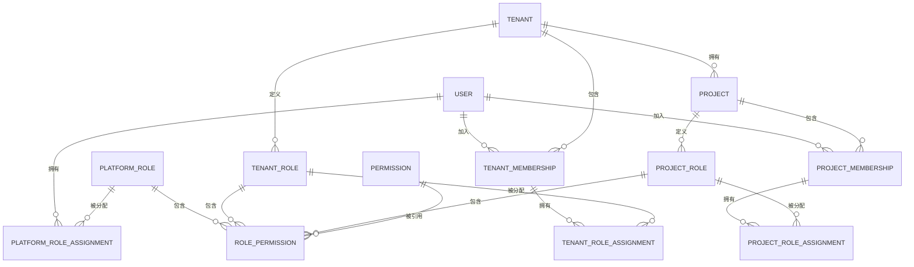
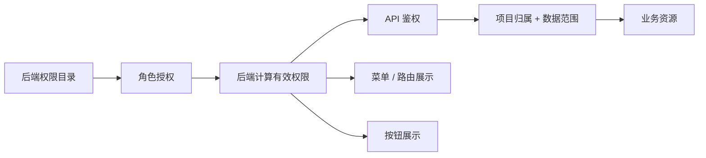

# 权限与多租户模型

> 目标：建立真正由后端执行的 RBAC，而不是只靠前端菜单显隐。  
> 核心表达式：主体 + 作用范围 + 权限动作 + 数据范围 + 资源状态。

## 1. 基本概念

| 概念 | 含义 |
| --- | --- |
| 用户 | 登录平台的人员身份 |
| 平台角色 | 在整个平台范围生效的角色 |
| 租户 | SaaS 客户组织，是项目、成员和业务数据的第一层隔离边界 |
| 租户成员关系 | 用户加入某租户的记录，包含状态、有效期和租户角色 |
| 租户角色 | 只在指定租户中生效的角色 |
| 项目成员关系 | 用户加入某项目的记录，包含状态和有效期 |
| 项目角色 | 只在指定项目中生效的角色 |
| 权限 | 对资源执行动作的稳定权限码 |
| 数据范围 | 获得动作权限后，还允许访问哪些行 |
| 当前租户/项目 | 本次请求明确操作的两层上下文，不等于用户唯一归属 |
| 系统约束 | 即使角色允许，也不能绕过的安全和业务限制 |

平台、租户和项目角色分开存储、分开分配。租户/项目成员关系不是平台账户的复制品，同一用户只保留一个平台身份，并可加入多个租户及项目。

## 2. 内置角色

### 2.1 Root

- 系统初始化时创建一个 Root 身份。
- Root 不通过普通角色编辑页面授权；其系统标识是不可变安全约束。
- Root 不能在在线管理界面被删除、停用、降级或取消 Root 身份。
- Root 可以创建、停用和调整超级管理员。
- Root 的密码、MFA 和恢复材料必须采用最高安全策略。
- Root 替换或灾难恢复只能走受控的离线运维流程，并产生不可抵赖的审计记录。

Root 的存在不代表日常操作都应使用 Root；日常平台管理使用超级管理员账号。

### 2.2 超级管理员

- 可以存在多个。
- 管理全局用户、租户、平台角色、全局设备类型、Broker、系统参数和平台审计。
- 可以进入租户/项目执行支持操作，但必须显式选择目标租户和项目并留下审计原因。
- 不能查看 Root 凭据、修改 Root、授予 Root 或绕过 Root 专属安全项。
- 可按职责拆成自定义平台角色，减少所有超级管理员都拥有全量权限的风险。

### 2.3 租户管理员

- 管理当前租户资料、成员、租户角色、所属项目和租户级配置。
- 不能访问其他租户，也不能创建平台角色或授予平台权限。
- 租户级 MQTT 配置只能授权给本租户项目；平台 Broker 密钥仍不可见。
- 移除最后一名有效租户管理员时必须先指定替代者。

### 2.4 项目管理员

- 每个项目至少保留一名有效项目管理员，归档项目除外。
- 管理本项目设置、成员、项目角色和业务数据。
- 只能授予本项目权限，不能创建平台角色或访问其他项目。
- 只能管理已经授权给本项目的 MQTT 路由，不能读取全局 Broker 密钥。
- 移除最后一名项目管理员时必须先指定替代者。

### 2.5 项目成员与自定义角色

- 新成员默认无业务权限，或由邀请流程显式分配基础角色。
- 一个成员可拥有多个项目角色，有效权限取同一项目内允许项的并集。
- 自定义项目角色只属于一个项目；可复制为新角色，但复制后独立演进。
- 内置角色可锁定关键安全权限，避免被改成无法管理的状态。

## 3. 授权数据模型



建议的关键实体：

- `user`：账户、安全状态、令牌版本、有效期。
- `platform_role`：内置或自定义平台角色。
- `platform_role_assignment`：用户与平台角色的关系及有效期。
- `tenant`：客户组织状态、归档信息、配额和配置版本。
- `tenant_membership`：用户在租户中的成员状态和有效期。
- `tenant_role` / `tenant_role_assignment`：租户角色及其成员分配。
- `project`：所属租户、项目状态、归档信息和配置版本。
- `project_membership`：用户在项目中的成员状态和有效期。
- `project_role`：内置或自定义项目角色。
- `project_role_assignment`：成员关系与项目角色的关系。
- `permission`：稳定权限码、作用域、资源和动作。
- `role_permission`：角色拥有的权限及允许的数据范围。
- `authorization_version`：用户、租户或项目授权版本，用于使缓存和旧令牌快速失效。

角色显示名称可以国际化，权限码不可随页面文案变化。

## 4. 权限码

### 4.1 命名

权限码使用稳定的 `资源:动作` 形式，必要时增加作用域前缀：

- `platform-user:read`
- `platform-user:manage`
- `platform-tenant:create`
- `tenant-project:create`
- `tenant-member:invite`
- `platform-broker:manage`
- `project-member:invite`
- `project-role:manage`
- `asset:read`
- `asset:update`
- `alert:handle`
- `device-command:publish`

通配符只允许在系统内置策略中使用，不向普通角色编辑器暴露任意字符串通配。

### 4.2 权限资源目录

| 作用域 | 资源示例 | 动作示例 |
| --- | --- | --- |
| 平台 | 用户、租户、平台角色、Broker、全局设备类型、系统设置、平台审计 | read、create、update、disable、archive、restore、manage |
| 租户治理 | 租户设置、成员、租户角色、项目目录、租户审计 | read、update、invite、assign、remove、create、archive、export |
| 项目治理 | 项目设置、成员、项目角色、项目审计 | read、update、invite、assign、remove、export |
| 资产 | 资产、资产类型、绑定、状态、导入导出 | read、create、update、archive、bind、import、export |
| 设备 | 网关、信标、设备类型、解析规则、扫描历史 | read、create、update、archive、configure、import、export |
| 地图定位 | 地图、区域、实时位置、轨迹 | read、upload、calibrate、draw、configure、export |
| 告警 | 告警、规则 | read、configure、acknowledge、assign、handle、close、export |
| 盘点 | 盘点任务和结果 | read、create、start、stop、cancel、export |
| 协作 | 任务、评论、文档 | read、create、update、assign、comment、upload、download、archive |
| MQTT 项目能力 | Topic 路由、映射、连接状态、设备命令 | read、configure、test、publish |
| 看板报表 | 看板、统计、导出 | read、export |

实施时由后端维护唯一权限目录，前端从接口读取可展示项，避免两套权限码漂移。

## 5. 数据范围

动作权限与数据范围分开判断。V1 使用可枚举、可测试的数据范围，不允许管理员输入任意 SQL 或表达式。

| 数据范围 | 含义 | 示例 |
| --- | --- | --- |
| `NONE` | 无数据 | 角色未获得该动作 |
| `SELF` | 用户本人创建或本人资料 | 修改个人资料 |
| `OWNED_OR_ASSIGNED` | 用户负责、创建或被指派的记录 | 项目任务 |
| `PROJECT` | 当前项目全部数据 | 项目管理员管理资产 |
| `AUTHORIZED_PROJECTS` | 用户被授权的一组项目 | 平台支持人员的跨项目只读 |
| `PLATFORM` | 全平台数据 | 超级管理员查看项目列表 |

规则：

- 数据范围不能把项目权限扩展到其他项目。
- 多个角色在同一范围内取允许集合并集。
- `PLATFORM` 只可由受控平台角色使用。
- 资源归档、项目归档、账户停用等系统约束优先于角色允许。
- 对资产、告警、文档等是否需要 `OWNED_OR_ASSIGNED`，按资源逐项开放，不能假定所有表都有“所有者”字段。

## 6. 多租户与多项目上下文

### 6.1 请求解析

项目业务 API 使用明确的租户与项目路径，例如：

```text
/api/v1/tenants/{tenantId}/projects/{projectId}/assets
```

后端按以下顺序处理：

1. 验证登录会话和账户状态。
2. 读取路径中的租户与项目，而不是接受请求体覆盖资源归属。
3. 验证租户、项目均有效，且项目属于该租户。
4. 验证用户有效的租户成员关系和项目成员关系。
5. 分别汇总用户在租户、项目中的有效角色和可委派边界。
6. 校验权限动作和数据范围。
7. 查询时强制追加租户与项目条件，并验证目标资源确实属于两层上下文。

创建业务数据时，`tenant_id` 和 `project_id` 由服务端根据已验证的路径上下文写入；请求体中的同名字段应被拒绝或忽略。

### 6.2 租户与项目切换

- 前端按“租户 → 项目”切换，只改变当前操作上下文，不重新定义用户权限。
- 用户只能查看自己的有效租户成员关系，以及各租户内有权进入的项目。
- 切换后重新加载菜单、按钮、字典和项目配置。
- 打开的旧页面提交请求时仍以 URL 中的项目为准，后端再次授权。
- 租户或项目成员被停用后，即使 Access Token 尚未过期，后续请求也必须被拒绝。

### 6.3 平台支持访问

超级管理员进入具体项目时：

- 必须显式选择项目。
- 界面清楚显示当前处于平台支持模式。
- 高风险写操作要求填写原因或二次确认。
- 审计同时记录平台角色和目标项目。

## 7. 角色管理与防提权

仅有“管理角色”权限还不足以授予任意权限。保存角色或分配角色时必须满足：

1. 授权人对目标作用域拥有角色管理权限。
2. 目标角色的每个可委派权限都在授权人的“可委派权限边界”内。
3. 项目管理员不能授予平台权限。
4. 超级管理员不能授予 Root。
5. 用户不能通过编辑自己的角色获得超出委派边界的权限。
6. 不能移除最后一个有效项目管理员。
7. 不能停用最后一个有效超级管理员；Root 恢复路径仍必须有效。
8. 角色变更使用版本或乐观锁，避免两名管理员并发覆盖。

权限分为“可使用”和“可委派”两个概念。例如，支持人员可以临时读取某项目，但不一定可以把该读取权限授予别人。

## 8. 菜单、按钮、API 与数据权限



- 菜单与按钮绑定权限码，只是有效权限的展示结果。
- API 每个写操作绑定明确权限，不用一个宽泛的“进入页面”权限代替。
- 批量接口逐项或按受控范围授权，不能先查 ID 再忽略项目条件。
- 导出权限独立于读取权限，避免通过导出获取大范围敏感数据。
- WebSocket 订阅、文件下载和异步任务结果也执行同一权限模型。

## 9. 默认权限矩阵

下表是角色能力边界，不代表每个动作都合并成一个权限码：

| 能力 | Root | 超级管理员 | 租户管理员 | 项目管理员 | 自定义项目角色 |
| --- | --- | --- | --- | --- | --- |
| 管理 Root | 受控自我安全操作 | 否 | 否 | 否 | 否 |
| 管理超级管理员 | 是 | 仅在被授予时，且不能操作 Root | 否 | 否 | 否 |
| 管理租户 | 是 | 按平台角色 | 仅当前租户资料/项目 | 否 | 否 |
| 管理全局 Broker 和密钥 | 是 | 按平台角色 | 否 | 否 | 否 |
| 管理租户 Broker 配置 | 是 | 支持模式/按权限 | 当前租户 | 按项目授权 | 按项目权限 |
| 管理租户成员和角色 | 是 | 支持模式/按权限 | 当前租户 | 否 | 否 |
| 管理项目成员和角色 | 是 | 支持模式/按权限 | 当前租户 | 当前项目 | 按可委派边界 |
| 管理项目业务数据 | 是 | 支持模式/按权限 | 按租户角色 | 当前项目 | 按权限和数据范围 |
| 下发设备命令 | 是 | 按权限且审计 | 按权限且审计 | 按权限且审计 | 必须显式授予 |
| 查看平台审计 | 是 | 按平台角色 | 否 | 否 | 否 |
| 查看租户/项目审计 | 是 | 支持模式/按权限 | 当前租户 | 当前项目 | 必须显式授予 |

Root 和超级管理员并不自动绕过设备命令参数校验、项目归档限制或协议安全约束。

## 10. 缓存与实时失效

- Token 只携带用户 ID、会话 ID、令牌版本和必要的稳定声明，不长期内嵌完整角色权限。
- 有效权限可以缓存在 Redis，缓存键包含用户、作用域、租户、项目和授权版本。
- 角色、成员、账户、租户或项目状态变化时，在数据库事务中提升授权版本并写 Outbox。
- API 即使未及时收到缓存失效事件，也会因版本不一致重新计算。
- 高风险操作可直接读取最新授权状态，不依赖缓存有效期。

## 11. 数据库第二道防线

对租户/项目业务表启用 PostgreSQL 行级安全时：

- 每个事务用 `SET LOCAL` 写入已验证的用户、租户和项目上下文。
- 租户级表只允许当前租户行；项目级表必须同时匹配当前租户和项目。
- 连接返回池前不得残留会话级变量。
- 普通 API 数据库角色不能拥有 `BYPASSRLS`。
- 平台任务使用独立、受审计的数据库角色和显式查询入口。
- 自动化测试覆盖连接池复用、跨租户和跨项目 ID 猜测。

RLS 只负责粗粒度租户/项目隔离；按钮动作、角色委派和业务状态仍由应用授权器判断。

## 12. 审计要求

必须审计：

- 登录成功/失败、登出、会话撤销和密码安全操作。
- Root、超级管理员、平台角色及其分配变化。
- 租户与项目创建、归档、恢复和管理员变化。
- 成员邀请、审核、角色分配、停用和移除。
- Broker、Topic 路由、协议映射、证书和解析规则变化。
- 设备命令、批量导出、告警规则及关键业务状态变化。
- 平台支持人员进入租户/项目及其高风险操作。

审计记录保存操作者、实际使用的角色范围、目标、动作、结果、请求关联 ID、时间和变更摘要；不得保存密码、Token 或明文密钥。

## 13. 必测授权场景

1. 同一用户在租户 A 是管理员、租户 B 是普通成员时，两边得到不同租户能力。
2. 同一用户在项目 A 是管理员、项目 B 是只读成员时，两个项目得到不同结果。
3. 修改 URL、请求体、批量 ID、导出任务或 WebSocket 目的地均不能跨租户或项目。
4. 成员被停用后，旧 Token 和已打开页面不能继续写入。
5. 自定义角色修改后，权限缓存及时或通过版本校验失效。
6. 租户/项目管理员不能给自己或他人授予平台权限。
7. 具有角色管理权但无某项“可委派权限”的用户不能授予该权限。
8. 超级管理员不能删除、停用或降级 Root。
9. 归档租户或项目拒绝普通业务写入，但允许授权用户只读和恢复。
10. 无导出权限的用户不能通过异步任务或猜测对象键下载文件。
11. MQTT 实时事件和设备命令严格按租户、项目、设备归属和动作权限授权。
12. RLS 在连接池复用后不会沿用上一请求的租户/项目上下文。
13. 删除最后一名租户管理员、项目管理员或超级管理员均被拒绝。
