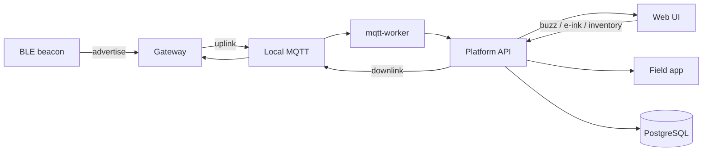

# Introduction

The Asset Management platform tracks **assets, BLE beacons, gateways, floor maps and zones**. Gateways publish scans and heartbeats over MQTT. The platform derives online status and supports alerts, inventory roll-call, buzzer find, and e-ink updates.

After an offline install you can sign in immediately: the local MQTT broker and access rules are created for you. You do not configure MQTT by hand.

## How data flows

The browser **never** connects to MQTT directly. The worker subscribes; the API enqueues downlink. A field app uses the same HTTP API — see [App API](appendix/app-api.md).

## Sidebar menus (as shipped)


**Platform Administration** is visible to **super admin** only. The header switches Simplified Chinese / English. Alert notifications and the login-page copyright need a license pasted on the ops page.


| Top-level | Child | Purpose |
| --- | --- | --- |
| **Overview** | — | Health, to-dos, offline devices, recent inventory |
| **Asset Center** | Assets | Create assets, bind beacons, buzz, e-ink |
| | Asset types | Categories |
| | Asset status | Assets + gateways, battery, RSSI |
| | Floor plan | Proximity placement |
| | Inventory | Roll-call sessions and reports |
| **Devices & Space** | Beacons | Register MACs, import, history |
| | Gateways | Create a gateway and copy MQTT credentials |
| | Maps | Floor images and real size |
| | Zones | Zones belong to a map |
| | Presence TTL | Offline timeouts |
| **Alert Center** | Events / rules / notifications | Tickets, conditions, email/webhook |
| **Analytics** | Asset analytics / daily summary | Health and scan volume |
| **MQTT Integration** | Connections, topics, monitor, commands | Broker; routes are pre-set |
| **GeoTag** | Map / Devices / Tracks | Appears after GeoTag is enabled and the role has the GeoTag permission. Bound assets whose device name is also in getList; tracks come from webhook or getHistory |
| **Platform Administration** | Users, roles, audit, mail, branding, ops, GeoTag integration | Super admin only |
| **Account** | Header avatar | Profile, email, password, alert sound |

Continue with [First-time setup](getting-started.md).
