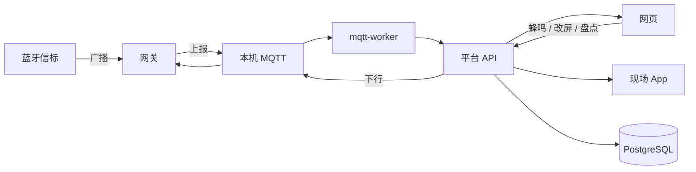

# 产品简介

资产管理平台用于管理现场 **资产、蓝牙信标、网关、平面图与区域**，通过 MQTT 接收网关扫描/心跳，判断在线状态，并支持告警、盘点、蜂鸣寻找和墨水屏改屏。

离线安装完成后即可登录使用：本机 MQTT 与接入规则会自动写入，无需再手工配置。

## 数据如何流动

| 环节 | 实际作用 |
| --- | --- |
| 信标 | 贴在资产上，被网关扫描后上报 MAC、RSSI、电量等 |
| 网关 | 按接入配置上报扫描，并接收平台下行 |
| Worker | 解析报文、更新在线状态、执行下行队列 |
| 网页 | 业务操作入口；浏览器 **不直接** 连接 MQTT |
| 现场 App | 调用同一套 HTTP API，用法见 [App 接口](appendix/app-api.md) |

## 侧栏菜单（与系统一致）


未登录可见登录页。登录后菜单由权限控制：**平台管理** 仅超级管理员可见。顶栏可切换简体中文 / English。告警通知和登录页版权需要在运维页粘贴授权码。


| 一级菜单 | 二级菜单 | 说明 |
| --- | --- | --- |
| **总览** | — | 台账、在线率、待办、离线设备、网关与最近盘点 |
| **资产中心** | 资产管理 | 建资产、绑信标、蜂鸣、墨水屏改屏 |
| | 资产类型 | 资产分类 |
| | 资产状态 | 资产 + 网关在线/电量/RSSI |
| | 平面图概览 | 邻近定位落点 |
| | 盘点管理 | 点名扫描与报表 |
| **设备与空间** | 信标管理 | 登记 MAC、导入、历史信号 |
| | 网关管理 | 创建网关并生成接入配置 |
| | 地图管理 | 楼层平面图与真实尺寸 |
| | 区域管理 | 区域归属地图 |
| | 在线阈值 | 网关 / 信标离线秒数 |
| **告警中心** | 告警事件 | 开单、确认、关闭 |
| | 告警规则 | 离线、低电、弱信号、盘点结果 |
| | 我的通知 | 邮箱 / Webhook 订阅 |
| **数据分析** | 资产分析 | 健康度与近 7 日扫描 |
| | 每日汇总 | 运营快照 |
| **MQTT 接入** | 连接管理 | 本机 Broker |
| | Topic 路由 | 安装后已预置，一般不用改 |
| | 消息监控 | 联调报文 |
| | 下行命令 | 排障或自定义下发 |
| **GeoTag 管理** | 位置地图 / 设备 / 轨迹 | 平台管理接通 GeoTag 后出现，角色还需勾选 GeoTag 管理权限。只显示资产里已有、且云上 getList 也有的设备；位置来自 Webhook 或 getHistory |
| **平台管理** | 用户 / 角色 / 审计 / 邮件 / 登录页 / 运维 / 对接 GeoTag | 仅超级管理员 |
| **个人中心** | 顶栏头像进入 | 资料、邮箱、密码、告警声音 |

## 建议阅读顺序

1. [离线安装](install/offline.md)
2. [第一次使用](getting-started.md)
3. 按菜单阅读：[总览](menus/overview.md) → [网关管理](menus/gateways.md) → [资产管理](menus/assets.md) → [告警事件](menus/alert-events.md)
